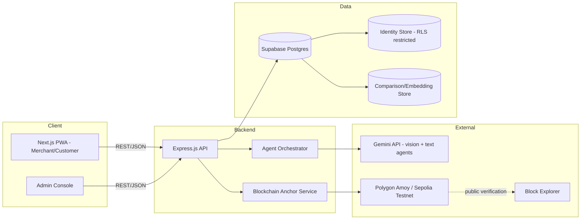
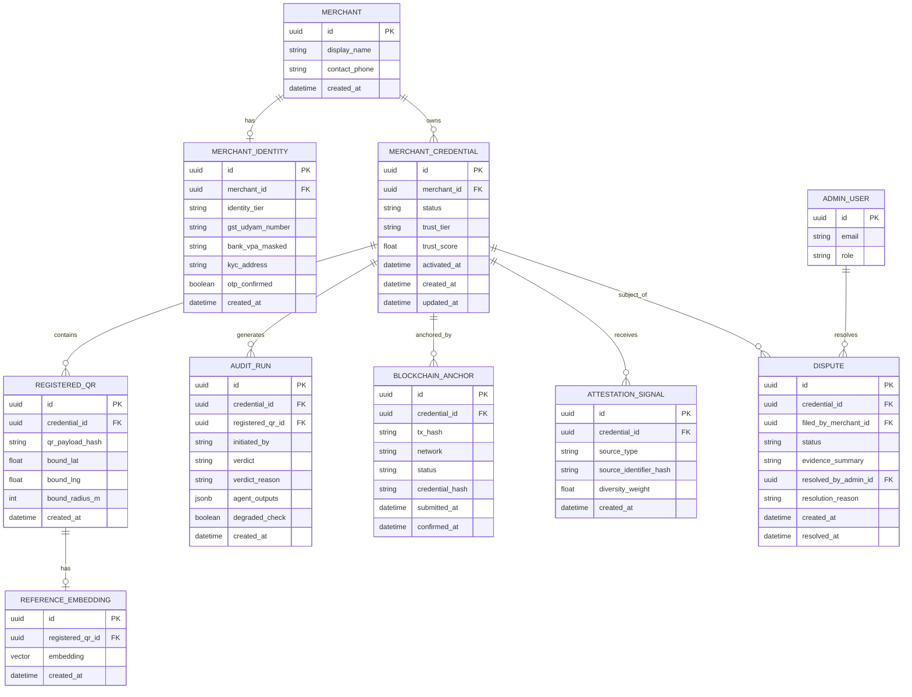

# ARCHITECTURE.md — QRaksha

## 1. Architecture Overview

In plain terms: a mobile-first web app (installable PWA) lets a merchant photograph their own QR sticker. The photo and decoded QR payload go to a backend API, which runs five short AI-agent checks (identity match, visual similarity, location match, corroboration, and a final consistency check) against a registered credential stored in Postgres. The result — VERIFIED / RECENTLY REGISTERED / WARNING — comes back to the app in a couple of seconds. Whenever a credential is created or changed, its hash is separately (and asynchronously) written to a public blockchain testnet so anyone can confirm the record hasn't been quietly altered.



## 2. Technology Stack

### Frontend

| Component            | Choice                                                               | Why selected                                                                                                       | Tradeoffs                                                        | Rejected alternatives                                                                                                                                    |
| -------------------- | -------------------------------------------------------------------- | ------------------------------------------------------------------------------------------------------------------ | ---------------------------------------------------------------- | -------------------------------------------------------------------------------------------------------------------------------------------------------- |
| Framework            | React + Next.js                                                      | Fast to build camera/scan UIs, file-based routing, strong PWA support, large ecosystem for a hackathon-speed build | Slightly heavier than a bare React SPA for a single-purpose app  | Plain Vite+React (rejected: less built-in PWA/routing convenience); SvelteKit (rejected: smaller ecosystem, team already MERN-fluent)                    |
| App shell            | PWA (installable, manifest + service worker)                         | No app-store gatekeeping; camera access works over HTTPS in any mobile browser; installable icon on home screen    | Camera/geolocation permission UX varies slightly across browsers | Native Android app (rejected: would solve the sandboxing gap but far too slow to build for MVP; explicitly deferred to Post-MVP default-QR-handler work) |
| QR decoding (client) | `jsQR` with fallback to native `BarcodeDetector` API where available | Works everywhere without a native dependency; `BarcodeDetector` is faster on supporting browsers                   | `BarcodeDetector` isn't universally supported (fallback needed)  | Server-side-only decoding (rejected: adds a network round trip before the user even sees a live preview)                                                 |
| Camera capture       | Browser `getUserMedia()`                                             | Standard, no plugin required                                                                                       | Requires HTTPS and explicit permission prompt                    | Native camera plugin (rejected: PWA-only strategy)                                                                                                       |
| Styling              | Tailwind CSS                                                         | Fast to build consistent, constrained UI without a design-system project                                           | Utility class verbosity                                          | CSS Modules / styled-components (rejected: slower iteration speed for the MVP timeline)                                                                  |
| Data fetching        | Native `fetch` + a thin React Query layer                            | Simple caching/retry for verdict and dashboard calls without a heavy state library                                 | One more dependency                                              | Redux + redux-saga (rejected: unnecessary complexity for this data-fetch pattern)                                                                        |
| Client-side state    | Local component state + React Query cache                            | Almost no genuinely global state exists (see Section 9)                                                            | —                                                                | Global store library (rejected: no justified need)                                                                                                       |

### Backend

| Component             | Choice                                                                                                | Why selected                                                                                 | Tradeoffs                                                                                       | Rejected alternatives                                                                                                                                             |
| --------------------- | ----------------------------------------------------------------------------------------------------- | -------------------------------------------------------------------------------------------- | ----------------------------------------------------------------------------------------------- | ----------------------------------------------------------------------------------------------------------------------------------------------------------------- |
| Runtime               | Node.js (LTS)                                                                                         | Matches team's MERN experience; same language as frontend                                    | Single-threaded CPU-bound work needs care (mitigated: agent calls are I/O-bound, not CPU-bound) | Python/FastAPI (rejected: spec allows Python only for optional server-side QR decode fallback, not as the primary backend, to keep one language across the stack) |
| Framework             | Express.js                                                                                            | Minimal, well understood, fast to scaffold REST routes                                       | Less opinionated structure than Nest.js (mitigated by explicit folder conventions in AGENTS.md) | Nest.js (rejected: more ceremony than a single-service MVP needs)                                                                                                 |
| API style             | REST/JSON over HTTPS                                                                                  | Simple, debuggable, matches PWA's fetch-based client                                         | No GraphQL flexibility                                                                          | GraphQL (rejected: no client-side query-shape complexity that would justify it)                                                                                   |
| Validation            | `zod` schemas shared between routes                                                                   | Type-safe request/response validation, catches malformed input before it reaches agent logic | Slight duplication if not shared with frontend types                                            | Manual if-checks (rejected: error-prone at this many endpoints)                                                                                                   |
| Background/async work | In-process async queue (in-memory job list processed on an interval) for blockchain anchoring retries | Avoids standing up a separate queue service for an MVP-scale pilot                           | Not durable across a process restart (acceptable for MVP; documented limitation)                | Redis/BullMQ (rejected for MVP: real infra dependency not justified at pilot scale; revisit at Stage 2)                                                           |

### Database

| Component       | Choice                                                                                                                                                 | Why selected                                                                            | Tradeoffs                                                | Rejected alternatives                                                                                                                                                                                                   |
| --------------- | ------------------------------------------------------------------------------------------------------------------------------------------------------ | --------------------------------------------------------------------------------------- | -------------------------------------------------------- | ----------------------------------------------------------------------------------------------------------------------------------------------------------------------------------------------------------------------- |
| Database        | Supabase (hosted Postgres)                                                                                                                             | Managed Postgres + auth + storage + Row Level Security in one product, fast to stand up | Vendor-hosted (acceptable at MVP scale)                  | Self-hosted Postgres (rejected: more ops overhead than an MVP needs); Firebase/Firestore (rejected: RLS-based fine-grained access control is a better fit for the identity/comparison data split than a document store) |
| ORM/query layer | Supabase JS client + hand-written SQL migrations                                                                                                       | Direct control over RLS-sensitive queries                                               | More manual than a full ORM                              | Prisma (rejected: RLS policies are central to this app's security model and are easiest to reason about with raw SQL migrations rather than an ORM abstraction layer)                                                   |
| Schema strategy | Two logically and access-separated schemas: `identity` (GST/Udyam, bank-linked names) and `comparison` (embeddings, audit events, credential metadata) | Directly implements the spec's "single high-value target" mitigation                    | Slightly more complex cross-schema joins for admin views | Single schema with column-level permissions (rejected: schema-level RLS separation is a clearer, more auditable boundary)                                                                                               |
| Migrations      | Supabase CLI migration files, version-controlled                                                                                                       | Reproducible, reviewable schema changes                                                 | —                                                        | Manual SQL via dashboard (rejected: not reproducible/auditable)                                                                                                                                                         |

### AI / Agent Reasoning

| Component                   | Choice                                                                                                                                                                                                                                                | Why selected                                                                                                                                                                                                                                                                                                                                                                                                                             | Tradeoffs                                                                                                                                             | Rejected alternatives                                                                                                                                                                                                                       |
| --------------------------- | ----------------------------------------------------------------------------------------------------------------------------------------------------------------------------------------------------------------------------------------------------- | ---------------------------------------------------------------------------------------------------------------------------------------------------------------------------------------------------------------------------------------------------------------------------------------------------------------------------------------------------------------------------------------------------------------------------------------- | ----------------------------------------------------------------------------------------------------------------------------------------------------- | ------------------------------------------------------------------------------------------------------------------------------------------------------------------------------------------------------------------------------------------- |
| Vision-capable LLM          | Gemini API (`gemini-2.0-flash` or latest available at build time)                                                                                                                                                                                     | Free-tier API key via Google AI Studio, strong multi-image input support, structured JSON output mode — fits a hackathon budget and timeline                                                                                                                                                                                                                                                                                             | External API dependency, latency and rate limits apply                                                                                                | Self-hosted vision model (rejected: far too slow to stand up for MVP timeline); OpenAI GPT-4V (rejected: no strong reason to diverge from the spec's chosen provider; Gemini's free tier and multi-image support were the deciding factors) |
| Agent implementation        | Five distinct system prompts against the same Gemini API — no separate model training or embedding pipeline for the _reasoning_ agents                                                                                                                | Keeps the "five agents" mental model without five separate services                                                                                                                                                                                                                                                                                                                                                                      | All five share one point of failure (the Gemini API) — mitigated by the degraded-mode fallback (Section 10, Error Handling)                           | Fine-tuned per-agent models (rejected: unnecessary complexity, no training data exists yet)                                                                                                                                                 |
| Visual similarity embedding | A dedicated image-embedding step (assumption: Gemini's embedding endpoint, or a lightweight open embedding model if the embedding endpoint isn't available at build time) run once at registration and once per audit, compared via cosine similarity | **Assumption/Decision:** the spec requires never storing the raw reference photo, but the Vision Agent's LLM call needs _something_ to compare against. Resolving this by extracting a numeric embedding at registration time (photo is discarded immediately after), then at audit time extracting a fresh embedding from the live photo and comparing the two vectors — no raw photo round-trips through the LLM as a stored reference | Slightly less rich comparison than a raw image-to-image LLM call, but that's the explicit tradeoff the spec accepts to avoid storing reference photos | Storing the raw reference photo (rejected: explicitly ruled out by the spec's data-security section)                                                                                                                                        |
| Structured output           | `responseMimeType: "application/json"` on every agent call                                                                                                                                                                                            | Makes agent outputs directly parseable without regex-scraping free text                                                                                                                                                                                                                                                                                                                                                                  | Occasional schema drift needs a JSON-schema validation guard on the response                                                                          | Free-text parsing (rejected: unreliable for a decision-critical pipeline)                                                                                                                                                                   |

### Blockchain

| Component           | Choice                                                                                                                               | Why selected                                                                                                                                             | Tradeoffs                                                                                                                                                                                                       | Rejected alternatives                                                                                                                                                                  |
| ------------------- | ------------------------------------------------------------------------------------------------------------------------------------ | -------------------------------------------------------------------------------------------------------------------------------------------------------- | --------------------------------------------------------------------------------------------------------------------------------------------------------------------------------------------------------------- | -------------------------------------------------------------------------------------------------------------------------------------------------------------------------------------- |
| Network             | Polygon Amoy testnet (fallback: Ethereum Sepolia)                                                                                    | Fast, cheap/free test transactions, EVM-compatible, has a public block explorer for the "anyone can verify" demo moment                                  | Testnet only — not a production trust anchor as-is                                                                                                                                                              | Mainnet (rejected: real transaction costs and irreversibility inappropriate for an MVP/demo); a private/permissioned chain (rejected: defeats the entire point of public auditability) |
| Anchoring mechanism | Plain transaction with the credential hash in the `data` field — **no smart contract**                                               | Simplest possible implementation that still delivers "publicly verifiable, tamper-evident record"; matches the spec's explicit "no overclaiming" framing | No on-chain query/indexing convenience a contract would give                                                                                                                                                    | A minimal smart contract via Remix (documented as an optional polish step, not core — see Section 13 of the source spec)                                                               |
| Backend library     | `ethers.js`                                                                                                                          | Standard, well-documented Node.js library for signing and sending transactions                                                                           | —                                                                                                                                                                                                               | `web3.js` (rejected: `ethers.js` has better TypeScript support and is the spec's stated choice)                                                                                        |
| Wallet              | A single server-held custodial wallet (private key in a secrets manager, never in source or client code) funded via a testnet faucet | Simplest model for a service that anchors on the merchant's behalf; the merchant never needs their own wallet or MetaMask                                | Centralizes signing authority in QRaksha's backend — acceptable and expected, since the spec is explicit that the blockchain component provides auditability of _QRaksha's own_ claims, not decentralized trust | Per-merchant MetaMask wallets (rejected: would require every merchant to manage a crypto wallet, contradicting the low-friction onboarding goal)                                       |

### Infrastructure

| Component                 | Choice                                                                                                                                    | Why selected                                                                                                |
| ------------------------- | ----------------------------------------------------------------------------------------------------------------------------------------- | ----------------------------------------------------------------------------------------------------------- |
| Frontend hosting          | Vercel                                                                                                                                    | Native Next.js support, zero-config PWA-friendly hosting, fast preview deploys                              |
| Backend hosting           | Render (or Railway)                                                                                                                       | Simple always-on Node service hosting for the Express API, easy env-var/secrets management                  |
| Database hosting          | Supabase managed Postgres                                                                                                                 | Bundled with the database choice above                                                                      |
| File storage              | Supabase Storage, used **only transiently** for in-flight photo uploads before embedding extraction; nothing is retained after extraction | Matches the "never store raw reference photo" requirement while still needing a place to receive the upload |
| Auth provider             | Supabase Auth (email/phone OTP for merchants; email/password for admins)                                                                  | Bundled with the database choice; supports RLS integration directly                                         |
| CDN                       | Vercel's built-in edge network                                                                                                            | Comes with the frontend hosting choice                                                                      |
| Monitoring/Error tracking | Sentry (frontend + backend)                                                                                                               | Widely adopted, fast to wire in, free tier sufficient for pilot scale                                       |
| Logging                   | Structured JSON logs to the hosting platform's log stream (Render/Vercel built-in)                                                        | No dedicated log aggregation service justified at MVP scale                                                 |
| Analytics                 | None in MVP beyond basic hosting-platform request metrics                                                                                 | Avoids scope creep; revisit post-MVP                                                                        |

### Development

| Component              | Choice                                                                            |
| ---------------------- | --------------------------------------------------------------------------------- |
| Package manager        | npm (npm workspaces for the monorepo — see Assumptions/Decisions below)           |
| Formatting             | Prettier                                                                          |
| Linting                | ESLint (TypeScript config)                                                        |
| Testing                | Vitest (unit), Supertest (API), Playwright (E2E)                                  |
| Git workflow           | Trunk-based with short-lived feature branches; PR required before merge to `main` |
| Environment management | `.env.local` per app, never committed; `.env.example` committed as a template     |

**Assumption/Decision — repository structure:** The source spec describes separate frontend and backend technology choices but doesn't specify repo layout. This project uses a single **npm-workspaces monorepo**:

```
/apps/web        → Next.js PWA (merchant, customer, admin console)
/apps/api        → Express.js backend
/packages/shared → shared zod schemas + TypeScript types used by both apps
```

This keeps shared validation schemas in one place and matches the "small modules, explicit interfaces" principle from the source brief, without the operational overhead of fully separate repositories at pilot scale.

## 3. System Architecture

- **Frontend (`apps/web`):** Next.js PWA. Three logical zones: merchant flows, customer `/check` flow, admin console. Talks to the backend only via authenticated REST calls (merchant/admin) or unauthenticated public endpoints (`/check`, `/verify/:id`).
- **Backend (`apps/api`):** Express API exposing REST routes (Section 6). Owns all writes to Postgres, all calls to Gemini, and all blockchain transactions. No frontend code ever calls Gemini or the blockchain directly (keeps API keys and the signing wallet server-side only).
- **Agent Orchestrator:** A backend module that sequences the five agents per the pipeline (QR Decode → [Identity, Vision, Context, Attestation] in parallel → Misbinding → Trust), assembles their structured outputs, and returns one verdict object.
- **Database:** Supabase Postgres, two RLS-partitioned schemas (`identity`, `comparison`) plus a shared `public` schema for non-sensitive lookup tables (demo registry metadata, tier definitions).
- **Authentication:** Supabase Auth issues JWTs; the Express API validates them on every authenticated route; RLS policies additionally enforce that a merchant can only read/write their own credential rows even if application-layer checks were bypassed (defense in depth).
- **External services:** Gemini API (agent reasoning), a public EVM testnet (credential anchoring), a block explorer (public verification, read-only, no integration needed beyond generating the correct URL).
- **Storage:** Supabase Storage used only as a transient upload buffer; a scheduled cleanup job deletes any object older than 10 minutes (should never happen in normal operation, since extraction is synchronous, but this is a safety net against a stuck upload).
- **Background jobs:** The in-process async queue (Section 2) retries failed blockchain anchoring attempts with exponential backoff (up to 5 attempts) before marking a credential's `chain_anchor_status` as `failed` for admin follow-up.
- **Caching:** A read-through cache (in-memory, keyed by QR payload hash) on the "QR payload → credential ID" lookup, since this is the hottest path on every scan and rarely changes.
- **Notifications:** MVP notifies in-app only (dashboard banner + audit history entry) on a WARNING verdict; email/SMS notification is Post-MVP.
- **Observability:** Sentry captures exceptions from both apps; every agent-pipeline run is logged with a correlation ID linking the request, the five agent outputs, and the final verdict for later debugging/demo replay.

## 4. Data Model



**Entity notes:**

- `MERCHANT_IDENTITY` lives in the `identity` schema (separately access-controlled). `identity_tier` ∈ `{gst_verified, baseline}`. `gst_udyam_number` and `bank_vpa_masked` are the only fields here that count as sensitive identity data.
- `MERCHANT_CREDENTIAL`, `REGISTERED_QR`, `REFERENCE_EMBEDDING`, `AUDIT_RUN`, `BLOCKCHAIN_ANCHOR`, `ATTESTATION_SIGNAL`, `DISPUTE` live in the `comparison`/operational schema — no raw identity documents here, only references (`merchant_id` foreign key, no denormalized GST number).
- `REFERENCE_EMBEDDING.embedding` stores a fixed-length float vector (`pgvector` extension); the raw photo that produced it is never persisted anywhere.
- `AUDIT_RUN.agent_outputs` stores the structured JSON returned by each of the five agents for that run — this is what makes a WARNING explainable and demo-replayable.

**Trust ramp — Assumption/Decision (concrete thresholds):**
The source spec intentionally leaves exact numbers open ("escalates via elapsed time, transaction history, and Attestation Agent corroboration"). This project adopts the following concrete formula so the MVP is testable and demoable:

- `trust_score` (0–100) = `min(40, days_since_activation * 4)` + `min(30, clean_audit_count * 3)` + `min(30, attestation_diversity_score * 30)`, where `attestation_diversity_score` (0–1) is the fraction of attesting sources that are _not_ part of a detected closed cluster.
- Tier mapping: `trust_score < 60` → 🟡 RECENTLY REGISTERED/UNVERIFIED; `trust_score >= 60` **and** `days_since_activation >= 3` (GST-verified) or `>= 7` (baseline) **and** zero unresolved WARNING events → 🟢 VERIFIED.
- Any single 🔴-triggering `AUDIT_RUN` (unknown QR, location mismatch, or misbinding) immediately sets `trust_tier = WARNING` regardless of `trust_score`, and it only clears via an admin/dispute-resolution action that explicitly resets it — it never auto-clears on the next clean scan alone.
- A new `REGISTERED_QR` added to an already-🟢 credential inherits a shortened ramp: it starts counted at `clean_audit_count = 2` (of the 10 needed to max that term) rather than 0, reflecting the credential's existing standing.

## 5. Database Schema

**`identity.merchant_identity`**

- Relationships: one-to-one with `public.merchant` (a merchant has exactly one identity record).
- Constraints: `gst_udyam_number` unique when not null; `bank_vpa_masked` unique per identity tier `baseline`.
- Indexes: unique index on `gst_udyam_number`; index on `merchant_id`.
- RLS: only the owning merchant (via `auth.uid()` mapped to `merchant_id`) and the `service_role` (used by the backend) can read this table. The admin role explicitly does **not** get row-level SELECT here in the MVP — admins see credential metadata, not raw identity documents, per the data-security requirement.

**`public.merchant`**

- Constraints: `contact_phone` unique.
- Indexes: index on `contact_phone`.

**`comparison.merchant_credential`**

- Relationships: many-to-one with `public.merchant`.
- Constraints: `status` ∈ `{pending_activation, recently_registered, active, suspended}`; `trust_tier` ∈ `{verified, unverified, warning}`.
- Indexes: index on `merchant_id`, index on `trust_tier` (admin queue queries).
- RLS: owning merchant can read/update their own row; admin role can read all rows and update `status`/`trust_tier` only via the dispute-resolution path (enforced in application logic, not raw column grants, to keep an audit trail via `DISPUTE`).

**`comparison.registered_qr`**

- Constraints: `qr_payload_hash` unique across the whole table (a QR payload can only ever be bound to one credential at a time — a second registration attempt for the same payload is rejected and directed to the dispute channel).
- Indexes: unique index on `qr_payload_hash` (this is the hot-path lookup on every scan).
- Query pattern: `SELECT credential_id FROM registered_qr WHERE qr_payload_hash = $1` — served from the in-memory cache first (Section 3).

**`comparison.reference_embedding`**

- Constraints: one-to-one with `registered_qr`.
- Indexes: `pgvector` IVFFlat index on `embedding` for cosine-similarity queries (used for the Vision Agent's comparison step).

**`comparison.audit_run`**

- Indexes: index on `credential_id, created_at desc` (audit history queries); index on `verdict` (admin/ops monitoring of WARNING rate).
- Retention/audit: append-only table, no updates or deletes — this _is_ the audit log for the verdict engine.

**`comparison.blockchain_anchor`**

- Constraints: `status` ∈ `{pending, confirmed, failed}`.
- Indexes: index on `credential_id`; unique index on `tx_hash` where not null.

**`comparison.attestation_signal`**

- Indexes: index on `credential_id`; `source_identifier_hash` is a one-way hash of the attesting party's identifier so raw identifiers of third-party attesters are never stored in the clear.

**`comparison.dispute`**

- Indexes: index on `credential_id, status` (open-disputes queue).
- Audit requirement: `resolution_reason` is required (non-null) whenever `status` transitions to `resolved_upheld` or `resolved_rejected`.

**`public.admin_user`**

- Managed via Supabase Auth with a `role = 'admin'` custom claim; not self-registerable.

## 6. API Design

**Conventions:**

- Base path: `/api/v1`.
- Success: `200`/`201` with `{ data: ... }`.
- Validation error: `400` with `{ error: { code: "VALIDATION_ERROR", details: [...] } }`.
- Auth error: `401` with `{ error: { code: "UNAUTHENTICATED" } }`.
- Authorization error: `403` with `{ error: { code: "FORBIDDEN" } }`.
- Not found: `404` with `{ error: { code: "NOT_FOUND" } }`.
- Conflict: `409` with `{ error: { code: "CONFLICT", details: "..." } }` (e.g., duplicate GST number, duplicate QR payload).
- Rate limited: `429` with `{ error: { code: "RATE_LIMITED", retryAfterSeconds: n } }`.
- Server error: `500` with `{ error: { code: "INTERNAL_ERROR", correlationId: "..." } }` — never leaks stack traces or internal details to the client.

| Method | Endpoint                                         | Auth                                | Purpose                                                                         |
| ------ | ------------------------------------------------ | ----------------------------------- | ------------------------------------------------------------------------------- |
| POST   | `/api/v1/merchants/register/identity`            | Public (start of flow)              | Submit GST/Udyam+OTP or VPA penny-drop identity claim                           |
| POST   | `/api/v1/merchants/register/reference`           | Merchant (in-progress registration) | Upload reference photo + GPS; returns embedding created, photo discarded        |
| POST   | `/api/v1/merchants/register/proof-of-possession` | Merchant                            | Trigger (mocked) ₹1 micro-transaction confirmation                              |
| GET    | `/api/v1/credentials/me`                         | Merchant                            | Get own credential(s) + tier + QR list                                          |
| POST   | `/api/v1/credentials/:id/qrs`                    | Merchant (owner)                    | Add a new QR under an existing credential                                       |
| POST   | `/api/v1/audit/run`                              | Merchant (owner)                    | Submit a live scan (QR payload + photo + GPS) for self-audit                    |
| GET    | `/api/v1/audit/history`                          | Merchant (owner)                    | Paginated past audit runs                                                       |
| POST   | `/api/v1/check`                                  | Public                              | Customer optional check: submit QR payload (+ optional photo/GPS) for a verdict |
| GET    | `/api/v1/verify/:credentialId`                   | Public                              | Read-only public credential summary + explorer link                             |
| POST   | `/api/v1/disputes`                               | Merchant                            | File a dispute against a credential                                             |
| GET    | `/api/v1/admin/disputes`                         | Admin                               | List open disputes                                                              |
| PATCH  | `/api/v1/admin/disputes/:id`                     | Admin                               | Resolve a dispute (upheld/rejected + reason)                                    |
| GET    | `/api/v1/admin/credentials`                      | Admin                               | Search/filter full credential registry (metadata only)                          |
| POST   | `/api/v1/admin/registry/seed`                    | Admin (dev/demo only)               | Seed the demo merchant registry                                                 |

**Rate-limit considerations:** `/api/v1/audit/run` and `/api/v1/check` are limited to 1 request per 5 seconds per client (IP + session) to prevent scan-spamming from exhausting Gemini API quota; `/api/v1/disputes` is limited to 3 per day per merchant against the same credential to deter dispute abuse.

## 7. Authentication & Authorization

- **Authentication method:** Supabase Auth. Merchants and customers who create an account authenticate via phone OTP (matches the identity-registration flow's existing OTP step); admins authenticate via email/password with mandatory MFA.
- **Session/token strategy:** Supabase-issued JWT, short-lived access token (1 hour) + refresh token; the Express API validates the JWT signature on every authenticated request.
- **Password handling:** Only applies to admin accounts; Supabase Auth handles hashing (bcrypt) — the application never touches raw passwords.
- **OAuth providers:** None in MVP (phone OTP only for merchants/customers).
- **Email verification:** Not required for merchants (phone OTP is the verification channel); required for admin accounts.
- **Password reset:** Standard Supabase Auth reset-link flow for admins.
- **Session expiration:** Access token expires after 1 hour; refresh token after 30 days of inactivity.
- **Refresh strategy:** Silent refresh via Supabase client SDK on the frontend.
- **Role-based access control:** Two roles — `merchant` (default on signup) and `admin` (manually provisioned, never self-serve). Customers using `/check` do not need an account at all.
- **Resource-level authorization:** Enforced at two layers — Express middleware checks the JWT's merchant/admin identity against the requested resource's owner before the handler runs, and Postgres RLS policies enforce the same rule at the database layer as defense in depth.
- **Admin privileges:** Admins can read credential metadata and audit history, resolve disputes, and trigger demo-registry seeding. Admins cannot read `identity.merchant_identity` rows directly in the MVP (least privilege — see Section 8).

## 8. Security Architecture

- **Input validation:** Every request body validated against a shared `zod` schema before touching business logic; QR payloads are length- and charset-bounded before being hashed or looked up.
- **Output encoding:** All API responses are JSON; the frontend renders any merchant-supplied display name through React's default escaping (no `dangerouslySetInnerHTML` anywhere in the merchant/customer-facing UI).
- **Injection:** Parameterized queries only (Supabase client / prepared statements) — no string-concatenated SQL anywhere.
- **XSS/CSRF:** JWT bearer-token auth (not cookie-session based) removes the classic CSRF vector for authenticated API calls; a strict `Content-Security-Policy` header is set on the Next.js app.
- **CORS:** The Express API allows only the deployed frontend origin(s) in production; wildcard CORS is disabled outside local development.
- **Rate limiting:** Per-route limits as specified in Section 6, enforced at the API gateway/middleware layer.
- **Brute-force protection:** OTP endpoints are rate-limited (max 5 attempts per phone number per 15 minutes) and OTPs expire after 5 minutes.
- **Secrets management:** Gemini API key, the blockchain signing wallet's private key, and Supabase service-role key are stored as encrypted environment variables in the hosting platform's secrets manager — never committed, never sent to the client.
- **Secure cookies/tokens:** JWTs are stored in memory + `httpOnly` refresh cookie on web, never in `localStorage`, to reduce XSS token-theft risk.
- **File upload security:** Reference/audit photo uploads are limited to 8MB, restricted to `image/jpeg` and `image/png` MIME types, and are deleted immediately after embedding extraction (synchronous step, no lingering objects).
- **API abuse:** The audit/check rate limits (Section 6) also serve as the primary defense against using QRaksha's endpoints to brute-force embedding comparisons against arbitrary photos.
- **Prompt injection (AI-specific):** Agent prompts treat all model input (QR payload text, any OCR'd text in a photo) as untrusted data, never as instructions; system prompts explicitly instruct each agent to ignore any embedded instructions found within image content or QR payload text.
- **LLM data leakage:** No identity-store data (GST number, bank details) is ever included in a Gemini prompt — only the QR payload hash, embedding vectors/comparison scores, and coordinates are sent. Raw photos sent to Gemini for a live comparison are not logged or retained by the application beyond the request lifecycle.
- **Tool permissions / agent boundaries:** Agents are read-only reasoning steps — none of the five agents can write to the database, call the blockchain, or take any action beyond returning a structured verdict fragment. Only the orchestrator (deterministic application code) acts on their output.
- **Human approval requirements:** Any dispute resolution requires an explicit admin action; no automated system ever silently suspends a credential without a `DISPUTE` record and (for upheld disputes) an admin-attributed reason.
- **Model failure behavior:** See Section 10 (Error Handling) — degrade to partial-agent verdict, never fail open to a false 🟢.
- **Logging sensitive information:** Logs include correlation IDs, verdict outcomes, and hashed identifiers — never raw GST numbers, raw bank VPAs, or raw photo bytes.
- **PII protection:** GST/Udyam numbers and bank-linked names are the only PII in the system; both live exclusively in the `identity` schema behind its own RLS policy set (Section 5).
- **Data encryption:** Supabase encrypts data at rest by default; all traffic is HTTPS/TLS only (enforced at the hosting platform level).
- **Dependency security:** `npm audit` run in CI on every PR; flagged high/critical vulnerabilities block merge.

**AI-specific data boundary (explicit table):**

| Allowed to reach Gemini                             | Never reaches Gemini                                |
| --------------------------------------------------- | --------------------------------------------------- |
| QR payload hash / decoded payload string            | GST/Udyam number                                    |
| Live audit photo (transient, in-request only)       | Bank VPA / bank-linked name                         |
| Reference embedding vector (not the original photo) | Any admin credentials or internal secrets           |
| GPS coordinates (rounded to ~100m precision)        | Other merchants' data outside the current audit run |

## 9. State Management

- **Server state:** All credential, audit, and dispute data lives on the backend; the frontend never treats this as authoritative beyond a React Query cache with short TTLs (verdict results are never cached client-side — always re-fetched live).
- **Client state:** Camera preview state, current scan step, form-wizard step index — local component state only.
- **URL state:** Route params carry resource IDs (`/verify/:credentialId`); no business data is encoded in query strings beyond admin list pagination/filter params.
- **Form state:** Registration wizard uses a single form-state object scoped to that flow, cleared on completion or navigation away.
- **Authentication state:** Owned entirely by the Supabase client SDK; the app reads it via its provided hooks rather than duplicating it into a separate store.

## 10. Error Handling

**Error categories:** `ValidationError`, `AuthenticationError`, `AuthorizationError`, `NotFoundError`, `ConflictError`, `RateLimitError`, `ExternalServiceError` (Gemini, blockchain testnet), `InternalError`.

- **API error format:** As specified in Section 6's conventions table — every error response includes a machine-readable `code` and, for `InternalError`, a `correlationId` for support/debugging.
- **User-facing messages:** Plain-language, never expose stack traces or internal codes; e.g., `ExternalServiceError` from Gemini surfaces as "We couldn't finish that check — try again in a moment," while the verdict engine simultaneously attempts the degraded path below.
- **Logging strategy:** Every error is logged with its correlation ID, category, and (for agent failures) which specific agent failed; Sentry captures unhandled exceptions from both apps.
- **Retry strategy:** Blockchain anchoring retries automatically (exponential backoff, 5 attempts) via the async queue; Gemini agent calls retry once immediately on a transient (5xx/timeout) failure before falling back to degraded mode.
- **Recoverable vs. non-recoverable:** A single agent's transient failure is recoverable (degrade to the remaining agents); a QR payload that fails to decode at all is non-recoverable for that scan (user is asked to rescan) but is not logged as a system error.
- **Degraded verdict mode (explicit rule):** If the Vision Agent or Attestation Agent fails, the Trust Agent proceeds using only Identity + Context + Misbinding results and marks `degraded_check: true` on the resulting `AUDIT_RUN`. If Identity **or** Context fails (the two agents that can independently trigger a 🔴), the pipeline does not guess — it returns a `service_unavailable` response rather than a possibly-wrong verdict.

## 11. Performance & Scalability

**MVP targets:**

- End-to-end self-audit/check verdict (cached QR lookup path): < 3 seconds p95.
- Dashboard/history page load: < 2 seconds p95.
- Database query latency: < 200ms p95 for all indexed lookups listed in Section 5.
- Blockchain anchoring: asynchronous, not on the user-facing critical path — a credential is usable while `chain_anchor_status = pending`.

**What should NOT be optimized prematurely:**

- No horizontal scaling / load balancing setup — a single Render/Vercel instance comfortably serves a single-cohort pilot.
- No dedicated vector-database service — Postgres `pgvector` is sufficient at this row count.
- No CDN-level image optimization pipeline — there are no persisted images to optimize (photos are transient by design).
- No read replicas or query result caching beyond the single in-memory QR-lookup cache described in Section 3.

## 12. Observability

- **Application logs:** Structured JSON, shipped to the hosting platform's log stream; every request tagged with a correlation ID.
- **Error tracking:** Sentry for both `apps/web` and `apps/api`.
- **Performance monitoring:** Sentry performance tracing on the `/api/v1/audit/run` and `/api/v1/check` routes specifically, since they're the latency-sensitive core loop.
- **Audit logs:** `comparison.audit_run` (verdict decisions) and `comparison.dispute` (resolution actions) together form the product's own audit trail, independent of infrastructure logs.
- **Analytics:** None beyond hosting-platform request counts in MVP (documented Non-Goal).
- **Health checks:** `GET /api/v1/health` returns `200` plus the status of the Gemini API and testnet RPC connectivity, used by the hosting platform's uptime monitor.
- **Important production alerts:** Elevated 🔴 WARNING rate over a rolling window (possible active fraud campaign or a broken agent), blockchain anchoring `failed` status accumulating past a threshold, Gemini API error rate spike.

## 13. Deployment Architecture

- **Development environment:** Local Next.js dev server + local Express server, pointed at a shared Supabase development project; Gemini calls use a development API key with a lower quota.
- **Staging environment:** A separate Vercel + Render deployment pointed at a staging Supabase project and a testnet wallet funded separately from production/demo, used for pre-demo rehearsal and PR preview validation.
- **Production environment (pilot):** Vercel (frontend) + Render (backend) + Supabase (production project) + the chosen public testnet (Amoy/Sepolia) with a dedicated, monitored signing wallet.
- **Environment variables (representative, not exhaustive):** `SUPABASE_URL`, `SUPABASE_SERVICE_ROLE_KEY`, `GEMINI_API_KEY`, `CHAIN_RPC_URL`, `CHAIN_PRIVATE_KEY`, `CHAIN_NETWORK`, `NEXT_PUBLIC_API_BASE_URL`.
- **Secrets:** Managed via the hosting platforms' built-in encrypted environment variable stores; `CHAIN_PRIVATE_KEY` additionally restricted to the backend service only, never exposed to any frontend build.
- **Database migrations:** Applied via the Supabase CLI (`supabase db push`) as part of the deployment pipeline, always reviewed in PR before merge.
- **Deployment process:** Merge to `main` triggers Vercel's automatic frontend deploy and a manual-approval-gated Render deploy for the backend (manual gate exists specifically because backend deploys can include migrations).
- **Rollback strategy:** Vercel supports instant rollback to a previous frontend deployment; Render supports redeploying a previous backend build. Database migrations are written to be additive/backward-compatible where possible so a frontend rollback never requires a matching destructive schema rollback.
