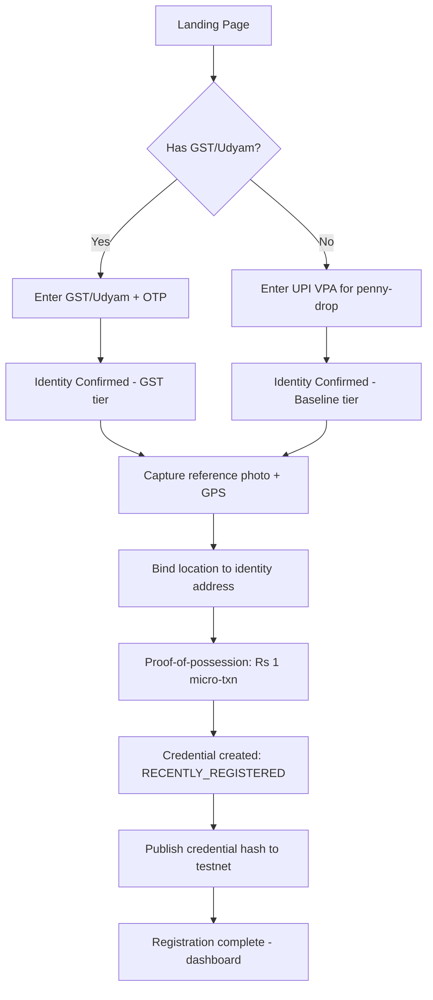
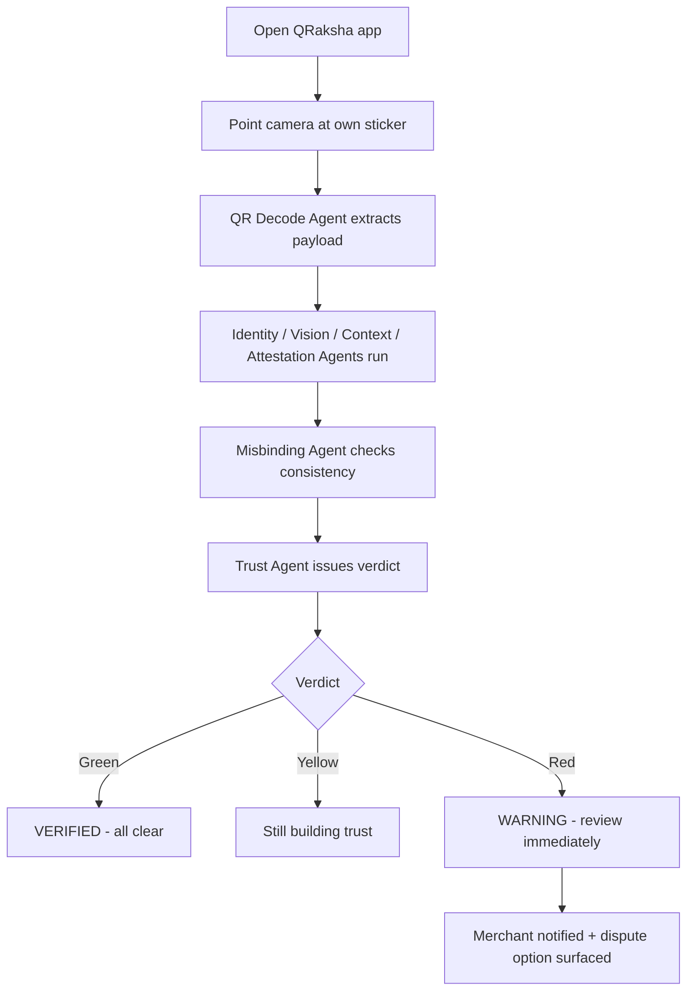
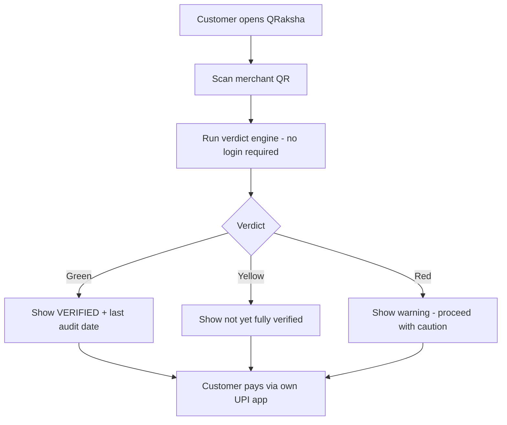
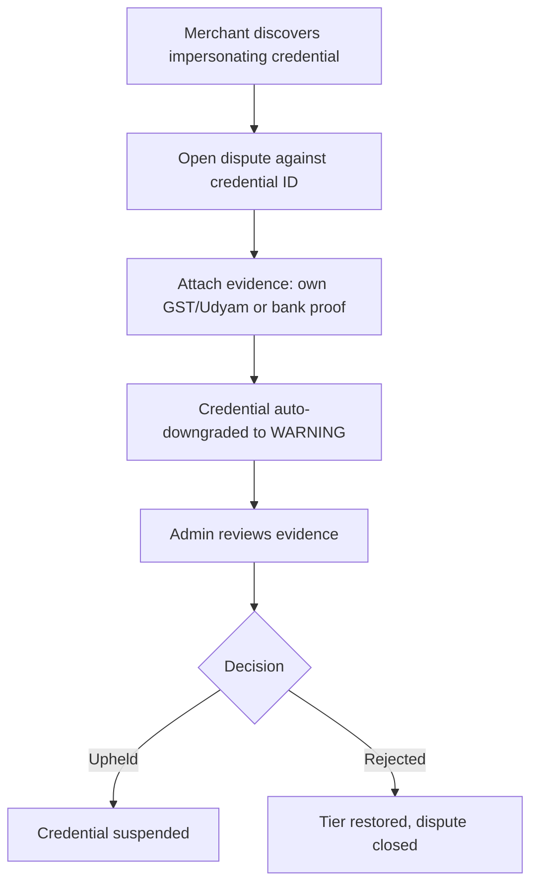

# PRD.md — QRaksha

Visual decisions live in DESIGN.md. Do not override them here.

## 1. Product Overview

**Product name:** QRaksha

**One-line description:** A merchant self-audit tool that verifies a physical UPI QR sticker hasn't been swapped, cloned, or relocated — backed by an AI verification pipeline and a public, tamper-evident blockchain record.

**Executive summary:** UPI apps verify _who receives the money_ once a QR is scanned. They cannot verify that the _physical sticker_ in front of a customer is the one the merchant actually put there. A scammer can paste a technically valid, fully-functional fake QR directly over a real one, or peel off a genuine QR and stick it somewhere else — and every existing UPI safeguard (signed QR, soundbox, bank-side fraud checks) passes the transaction anyway. QRaksha closes this gap by having the **merchant**, not the customer, periodically re-scan their own sticker. An AI agent pipeline compares the current scan against a registered credential (QR identity, reference visual signature, and bound location) and returns a trust verdict. The credential's hash is anchored to a public blockchain testnet so the verdict process is independently auditable, not just "trust our database."

**Problem statement:** QR-swap and QR-relocation fraud against physical UPI stickers is real, current, and typically undetected for days because nothing in the existing UPI stack checks whether _this exact sticker, in this exact place_ is the one the merchant registered.

**Why the problem matters:** Physical QR codes are now the default payment surface for a huge share of small Indian merchants (canteens, street vendors, parking stands, petrol pumps). A single swapped sticker silently redirects every payment made against it until someone notices — often the merchant, days later, when expected money never arrived. The fraud is cheap to execute (print a sticker) and expensive to detect (nobody is checking).

**Target users (primary):** Small and medium physical-retail merchants who accept UPI via a printed/laminated QR sticker — canteens, kirana stores, street vendors, parking operators, campus vendors.

**Secondary users:**

- **Customers** — optionally scan a merchant's QR with QRaksha before paying, for unfamiliar vendors or high-value payments.
- **Platform admins/operators** — manage the merchant registry, review disputes, monitor the demo/pilot cohort.
- **Market association / campus coordinators** (Stage 2, post-MVP) — onboard a batch of merchants under one trusted cohort.

**Core value proposition:** "NPCI verifies identity. QRaksha verifies that today's sticker is the one you put there yesterday — and gives anyone a public record to check that claim against."

**Product principles:**

1. **Merchant-side first.** The primary flow is merchant self-audit, not customer-side scanning, because customers overwhelmingly scan from inside GPay/PhonePe, a flow no third-party app can see (Android sandboxing).
2. **Trust is earned, never granted.** No credential starts at full 🟢 VERIFIED. Trust ramps up over time and verified activity.
3. **Never overclaim the blockchain.** It provides public auditability of QRaksha's own records, not decentralized trust.
4. **Minimize what's stored.** Raw reference photos are never persisted — only vision embeddings/hashes. Identity documents (GST/Udyam, bank-linked names) live in a separately access-controlled store from day-to-day comparison data.
5. **Fast at scan time, slow at registration time.** Every expensive check (OTP, GST/Udyam lookup, penny-drop) happens once at registration. A live audit only does a cached lookup plus a lightweight embedding comparison.

**Key assumptions** (see also per-section "Assumptions / Decisions" call-outs):

- The MVP targets a single pilot cohort (one campus or one market association), not a national rollout.
- GST/Udyam government verification and bank penny-drop are **simulated/mocked** for the MVP build and demo (see Section 4, "Built vs. Designed"); production would integrate real GSTN/NPCI/bank APIs.
- The ₹1 proof-of-possession micro-transaction is simulated in the MVP; the flow and data model are built as if it were real so it can be swapped for a live payment integration later.
- "Location bound to an independent address record" is implemented in the MVP as a GPS-vs-declared-address distance check against a manually-entered GST/Udyam/bank KYC address (not a live government API call).

## 2. Goals

### MVP Goals

- A merchant can register a credential (identity tier + reference photo + location + one or more QR codes) in under 5 minutes.
- A merchant can run a self-audit in under 60 seconds and receive a 🟢/🟡/🔴 verdict.
- The system correctly flags a **QR replacement** (different QR payload than any registered QR under that credential) as 🔴 WARNING.
- The system correctly flags a **QR relocation** (a registered, valid QR payload scanned outside its bound location radius) as 🔴 WARNING — this is the flagship differentiator.
- No credential can reach 🟢 VERIFIED before it satisfies the trust-ramp criteria (Section "Trust Ramp," Data Model).
- Every credential's hash is published to a public EVM testnet, and any user can verify it via a block explorer link surfaced in the app.
- A customer can optionally run the same check before paying, without needing to be the registering merchant.
- A merchant can file a dispute against a credential fraudulently registered under their name or address.
- A demo registry of 5–10 fictional merchants exists for live demonstration.

### Non-Goals (MVP)

- No real integration with GST/Udyam government verification APIs, real bank penny-drop, or a real OTP-to-government-record flow — these are simulated with a clearly documented mock boundary.
- No Android "default QR handler" registration or notification-listener post-payment alert (Android OS-level integration) — documented as designed-but-not-built.
- No actual UPI payment processing of any kind. QRaksha never touches the payment itself.
- No PSP (GPay/PhonePe) SDK embedding.
- No smart contract on the blockchain layer — MVP publishes a plain transaction with the credential hash in the `data` field.
- No multi-tenant market-association admin console (Stage 2 feature).
- No monetized "Verified" badge purchase flow.
- No production-grade security audit, penetration testing, or DPDP/RBI regulatory sign-off — explicitly flagged as a pre-production requirement, not an MVP deliverable.

## 3. User Personas

### Persona 1 — Registered Merchant (primary)

- **Role:** Owner/operator of a small physical storefront or stall (canteen, kirana store, vendor cart).
- **Goals:** Confirm their payment sticker hasn't been tampered with; protect daily revenue; build a visible trust signal for customers.
- **Pain points:** No existing tool checks the physical sticker; fraud is discovered only when expected money doesn't arrive; low tolerance for anything that slows down the payment counter.
- **Technical sophistication:** Low to moderate. Comfortable with a UPI app but not with technical jargon.
- **Typical workflow:** Registers once. Opens QRaksha once a day (or on a reminder) and points the camera at their own sticker for ~10 seconds.
- **Main reason for using the product:** Peace of mind + an early-warning system for QR tampering.
- **Important permissions:** Can register/edit their own credential and QR set, run self-audits, view their own trust tier and history, file a dispute against a credential impersonating them.

### Persona 2 — Unregistered / GST-less Merchant

- **Role:** Same as Persona 1, but without formal GST/Udyam registration (very common for small vendors).
- **Goals:** Same as Persona 1, without needing paperwork they don't have.
- **Pain points:** Formal KYC-style registration flows assume documents they may not hold.
- **Technical sophistication:** Low.
- **Typical workflow:** Registers via UPI VPA/bank-account name-match (penny-drop) only, gets a baseline credential, ramps trust more slowly than a GST-verified merchant.
- **Main reason for using the product:** Same protection, lower onboarding barrier.
- **Important permissions:** Same as Persona 1; credential is flagged internally as "baseline tier" (affects trust-ramp speed, not user-visible shaming).

### Persona 3 — Customer (secondary, optional)

- **Role:** Person about to pay at a shop, vendor, or stall.
- **Goals:** Confirm a QR is legitimate before paying, especially at an unfamiliar shop or for a large amount.
- **Pain points:** Doesn't want to install a separate app just to check; will not do this for every purchase.
- **Technical sophistication:** Varies widely.
- **Typical workflow:** Opens QRaksha only occasionally, scans a merchant's QR, sees the merchant's current trust tier and last self-audit date, then pays via their normal UPI app.
- **Main reason for using the product:** Occasional extra assurance for high-stakes or unfamiliar payments.
- **Important permissions:** Read-only check against the public credential registry; no registration required to use this flow.

### Persona 4 — Platform Admin / Operator

- **Role:** QRaksha team member operating the pilot.
- **Goals:** Seed and manage the demo merchant registry; review and resolve disputes; monitor overall fraud-flag rates during the pilot.
- **Pain points:** Needs visibility into flagged credentials without exposing merchants' private identity data.
- **Technical sophistication:** High (internal team).
- **Typical workflow:** Logs into an internal admin view; reviews disputes queue; can suspend a credential pending review.
- **Important permissions:** Can view credential metadata and audit history (not raw identity documents, which stay in the separately access-controlled identity store), resolve disputes, suspend/reinstate credentials.

## 4. Core Features

### MVP

**Feature: Merchant Registration (Tiered Identity)**

- Purpose: Create a Merchant Credential without gatekeeping merchants who lack formal registration.
- User value: Low-friction onboarding regardless of formal-business status.
- User story: As a merchant, I want to register using whatever identity proof I have, so that I get protection without needing paperwork I don't have.
- Functional requirements: Two registration paths — (a) GST/Udyam number + OTP confirmation to the mobile/email on file (simulated in MVP), or (b) UPI VPA/bank-account name-match / penny-drop (simulated in MVP). Path (a) yields a faster trust-ramp; path (b) yields a baseline credential with a slower ramp.
- Acceptance criteria: A merchant completes either path in under 3 minutes; the resulting credential is created in `RECENTLY_REGISTERED` state; the identity tier (GST-verified vs. baseline) is stored and affects ramp speed but is never shown to customers as a negative signal.
- Edge cases: Duplicate GST number already registered by another account → block and surface the dispute channel. Penny-drop name mismatch → registration fails with a clear message, no partial credential created.
- Dependencies: Identity data store (separately access-controlled from comparison data).
- Classification: MVP.

**Feature: Reference Capture & Location Binding**

- Purpose: Establish the visual and geographic baseline a future self-audit is compared against.
- User value: The system knows what "correct" looks like for this merchant.
- User story: As a merchant, I want to photograph my QR sticker once, so future scans can be checked against it.
- Functional requirements: Capture one or more reference photos of the QR + surrounding surface; capture GPS coordinates at time of photo; compute and store a vision embedding (never the raw photo); bind GPS to the address on file from the identity record (GST/Udyam/bank KYC address) with a maximum allowed distance (see Assumptions/Decisions in ARCHITECTURE.md for the default radius).
- Acceptance criteria: A credential cannot be created without at least one bound location and one embedding; raw photo bytes are discarded after embedding extraction, never written to persistent storage.
- Edge cases: GPS unavailable/denied → registration blocked with an explanatory permission-denied state. Registration location farther than the allowed radius from the identity address → registration is allowed but flagged `location_variance` for admin visibility (does not block, since legitimate businesses can have address-record mismatches).
- Dependencies: Device camera + geolocation permissions; embedding generation step.
- Classification: MVP.

**Feature: Multi-QR Support per Credential**

- Purpose: Reflect real merchant behavior — a billing counter, a takeaway window, and app-specific stickers may each carry a distinct QR under the same business.
- User value: Merchants don't need a separate account per physical sticker.
- User story: As a merchant with three counters, I want each counter's QR under one account, so I audit them together.
- Functional requirements: A credential can hold N `RegisteredQR` records, each with its own reference embedding and bound location; adding a new QR to an already-trusted credential inherits an abbreviated ramp (see Data Model).
- Acceptance criteria: Self-audit flow lets the merchant pick which QR they're auditing (or auto-detects via QR payload lookup).
- Edge cases: Two QR codes under one credential with wildly different locations (e.g., different city) → flagged for admin review.
- Dependencies: Registration flow.
- Classification: MVP.

**Feature: Proof-of-Possession Micro-Transaction**

- Purpose: Confirm the registering party actually controls the VPA being registered.
- User value: Raises the cost of registering someone else's VPA fraudulently.
- User story: As the system, I want to confirm VPA control once, so a credential can't be created against a VPA the registrant doesn't own.
- Functional requirements: A ₹1 transaction is initiated to the registering VPA at registration time only; credential activation is blocked until it's confirmed. **Simulated in the MVP** via a mock payment confirmation step that the demo operator triggers manually.
- Acceptance criteria: Credential status is `PENDING_ACTIVATION` until proof-of-possession is confirmed, then transitions to `RECENTLY_REGISTERED`.
- Edge cases: Simulated failure path → credential remains `PENDING_ACTIVATION` indefinitely and is purge-able by the merchant.
- Dependencies: None beyond the mock.
- Classification: MVP (mocked).

**Feature: Agent Pipeline (Self-Audit Verdict Engine)**

- Purpose: Turn a live scan into a trust verdict.
- User value: This is the core product — the reason the app exists.
- User story: As a merchant, I want to scan my sticker and immediately know if something's wrong.
- Functional requirements: On a self-audit or customer check, run: (1) QR Decode Agent extracts the payload; (2) in parallel — Identity Agent matches payload to a registered QR, Vision Agent compares live photo embedding to stored reference embedding (soft signal only), Context Agent compares live GPS to bound location, Attestation Agent checks payer/nearby-merchant diversity supporting this credential's history; (3) Misbinding Agent checks whether all signals are internally consistent (e.g., right QR payload but wrong location); (4) Trust Agent combines everything into one of the three verdicts.
- Acceptance criteria: End-to-end verdict returned in under 3 seconds for a cached/known QR (see Architecture, Performance targets); a QR payload that matches no registered QR under any credential returns 🔴 WARNING with reason `UNKNOWN_QR`; a QR payload that matches a registered QR but fails the Context Agent's location check returns 🔴 WARNING with reason `LOCATION_MISMATCH` (the flagship "relocation" case); Vision Agent's signal alone never triggers a 🔴 verdict.
- Edge cases: Gemini API timeout/failure → verdict engine falls back to a degraded verdict using only Identity + Context Agents, and surfaces `degraded_check: true` to the user rather than silently returning a false positive/negative.
- Dependencies: Vision-capable LLM API, credential registry, embedding store.
- Classification: MVP.

**Feature: Trust Tiers & Trust Ramp**

- Purpose: Prevent a freshly (or fraudulently) registered credential from immediately looking as trustworthy as a long-standing one.
- User value/system value: Sybil resistance; makes registration-fraud economically unattractive.
- User story: As the system, I want new credentials to earn trust over time, so a scammer can't register a fake credential and get instant legitimacy.
- Functional requirements: See Data Model for the concrete scoring formula and thresholds (documented as an explicit Assumption/Decision, since the source spec intentionally left exact numbers open).
- Acceptance criteria: A credential created "just now" cannot show 🟢 VERIFIED under any circumstance; a single 🔴 WARNING event immediately overrides tier to 🔴 regardless of accumulated trust, and clears only after admin/dispute review.
- Edge cases: Attestation from a tight cluster of accounts that only ever transact with each other is discounted, not counted as diversity (Sybil defense).
- Classification: MVP.

**Feature: Blockchain Credential Anchoring**

- Purpose: Public, tamper-evident proof that a credential record hasn't been silently altered.
- User value: Anyone — including a skeptical customer or judge — can verify the claim without trusting QRaksha's database.
- User story: As a customer, I want to independently check that a merchant's credential record hasn't been quietly changed.
- Functional requirements: On credential creation and on any material update (new QR added, location changed), compute a hash of the credential's canonical fields and publish it as a plain transaction (data field, no smart contract) to a public EVM testnet (Polygon Amoy or Ethereum Sepolia). Surface the transaction hash and a block-explorer deep link in the app.
- Acceptance criteria: Every credential has at least one on-chain anchor before it can leave `PENDING_ACTIVATION`; the explorer link resolves and the on-chain data matches a locally recomputed hash.
- Edge cases: Testnet congestion/failure → anchoring is queued and retried asynchronously; the credential is usable (not blocked) while `chain_anchor_status = pending`.
- Dependencies: A funded testnet wallet, `ethers.js`.
- Classification: MVP.

**Feature: Customer Optional Check**

- Purpose: Give customers an extra check for unfamiliar or high-value payments, without requiring merchant-side data.
- User value: Peace of mind on demand.
- User story: As a customer, I want to scan a QR before I pay at an unfamiliar shop.
- Functional requirements: Same verdict engine as self-audit, launched without requiring the customer to have a merchant account; shows verdict, merchant display name (if VERIFIED), and last self-audit timestamp.
- Acceptance criteria: Works without login; never blocks or delays the customer's actual UPI payment (informational only, since QRaksha cannot intercept the payment app).
- Edge cases: QR belongs to no registered credential → 🟡 with an explicit "not yet registered with QRaksha" message, not treated as a red flag by itself.
- Dependencies: Verdict engine.
- Classification: MVP.

**Feature: Dispute Channel**

- Purpose: Let a real merchant contest a credential fraudulently registered under their name/location.
- User value: Recourse against registration-time fraud.
- User story: As a merchant, I want to flag a fake credential using my business identity, so it gets investigated and taken down.
- Functional requirements: Any merchant (or admin, on a report) can open a dispute against a `MerchantCredential`, attaching supporting evidence; disputed credentials are immediately downgraded to 🔴 WARNING pending review; admin resolves as upheld (credential suspended) or rejected (dispute closed, tier restored).
- Acceptance criteria: Dispute creates an audit-trail entry; resolution requires an admin action and a recorded reason.
- Edge cases: Repeated frivolous disputes from the same account against the same credential → rate-limited.
- Dependencies: Admin console.
- Classification: MVP.

**Feature: Demo Merchant Registry Seeding**

- Purpose: Provide a realistic, ready-to-demo dataset.
- Functional requirements: Seed 5–10 fictional merchants (e.g., Sharma Canteen, ABC Petrol Pump, Fresh Bites, Campus Cafe, City Parking) each with a registered QR, reference embedding, and bound location, spanning different trust tiers.
- Acceptance criteria: Demo script can show a 🟢 VERIFIED merchant, a 🟡 fresh registration, a 🔴 replacement, and a 🔴 relocation without any live registration steps.
- Classification: MVP.

### Post-MVP

- Android default-QR-handler registration (lets QRaksha intercept scans made outside a payment app).
- Notification-listener post-payment alert (best-effort post-payment fraud alert when QRaksha cannot see the pre-payment scan).
- Paid "Verified" trust badge as a merchant marketing product.
- Market-association / campus batch-onboarding admin tooling (Stage 2 cohort expansion).
- Per-verification licensing API surface for a market association or PSP.

### Future / Experimental

- Licensable verification SDK embedded directly into a PSP's (GPay/PhonePe) own scan flow.
- Real GST/Udyam government API + OTP integration.
- Real bank penny-drop API integration.
- RBI/NPCI sandbox engagement and DPDP-compliant consent framework.
- Optional minimal smart contract (vs. plain transaction) for the blockchain anchor.

## 5. Core User Flows

### First-time merchant registration flow

### Merchant self-audit flow (primary, recurring)

### Customer optional check flow

### Dispute flow

### Returning-user / settings flow

Merchant logs in → dashboard shows current tier per QR, last audit timestamp, on-chain anchor link, and a "Run self-audit now" call-to-action. Settings: manage registered QRs, view identity-tier status, view dispute history, log out.

### Failure/error flow (shared across audit and check)

Any agent call failure → verdict engine attempts degraded mode (Identity + Context only) → if that also fails, surfaces "Unable to verify right now — try again" with no false verdict ever shown; failures are logged with a correlation ID, never silently defaulted to 🟢.

### Admin flow

Admin logs into internal console → sees flagged/disputed credentials queue → opens a credential → views metadata, audit history, on-chain anchor, and any dispute evidence (not raw identity documents) → resolves or escalates.

## 6. UI/UX Specification

Visual decisions live in `DESIGN.md`. Do not override them here.

### Design Language

- **Overall visual style:** Utilitarian, institutional, precise security-grade interface (see `DESIGN.md`, section 1). Clear, high-contrast, camera-first. The product's entire value is a fast, unambiguous verdict, so the UI never buries it.
- **Brand personality:** Calm authority — "If a bank and a hardware security lab designed a landing page" (see `DESIGN.md`, section 1). Restraint over decoration. No playful mascots, neon cyberpunk, matrix text, or stock shield/padlock icons; confident, plain language.
- **Density:** Low-to-medium density on merchant/customer screens (large verdict states, large tap targets for low-tech-literacy users); medium-to-high density on the admin console.
- **Border radius:** 4px radius across cards, buttons, and inputs (near-square, not pill; see `DESIGN.md`, section 4 and section 5).
- **Shadows:** None (see `DESIGN.md`, section 4 and section 10). 1px borders define edges; no drop shadows or card lifts.
- **Cards:** Defined in `DESIGN.md`, section 5. Verdict result card uses a 4px border radius, a 4px solid verdict color on the left edge (never a top band), mono verdict label, one-line reason, a 3-row evidence breakdown (Identity / Vision / Context) with pass/flag chips, and a top-right shield icon in the semantic verdict color.
- **Buttons:** Defined in `DESIGN.md`, section 5. Primary button uses brand orange fill, ink text, 4px radius, 40px height. Secondary button uses transparent fill with 1px border.
- **Forms:** Single-column, one field group per step (multi-step registration wizard rather than one long form).
- **Navigation:** Bottom tab bar on mobile (Home / Scan / History / Settings); left sidebar on desktop admin console only. Sticky nav on landing page per `DESIGN.md`, section 5.
- **Typography hierarchy:** Defined in `DESIGN.md`, section 3. Clean grotesk (Inter Tight, Geist, or General Sans) for display and body, paired with monospace (JetBrains Mono or Geist Mono) for labels, eyebrows, step numbers, hashes, and verdict tags.
- **Iconography:** Monoline icons (1.5px stroke, square caps, brand color; see `DESIGN.md`, section 6). Verdict status is conveyed by accessible icons paired with text labels, never color alone.
- **Animation philosophy:** Defined in `DESIGN.md`, section 7. Motion uses standard easing `cubic-bezier(0.22, 1, 0.36, 1)`; scan line and verdict shield resolve is the one signature animation. Respect `prefers-reduced-motion`.

### Color System

All color tokens, surfaces, and values are defined in `DESIGN.md`, section 2 (Color System) and section 11 (CSS tokens).

- **Core Palette:** Warm near-black background (`--bg-ink`), peach light background (`--bg-peach`), and brand orange (`--brand`) accent. See `DESIGN.md`, section 2.
- **Verdict Colors (Semantic Only):** `--ok` (VERIFIED), `--warn` (UNVERIFIED), and `--danger` (WARNING). Verdict colors appear strictly inside verdict UI, the three-tier explainer, and demo result states.
- **Strict Rule:** Brand orange is never used for warning or danger states; verdict colors are semantic-only and never used decoratively (see `DESIGN.md`, section 2 and section 10).

### Responsive Design

- **Mobile (default, primary target):** Single column, camera view fills most of the viewport during scan, bottom tab navigation, breakpoint < 640px. Breakpoints follow `DESIGN.md`, section 9 (640px, 1024px, 1280px).
- **Tablet:** 640–1024px — same layouts, wider margins, no structural change.
- **Desktop:** > 1024px — merchant/customer flows remain centered single-column (max-width 480px) since this is fundamentally a phone-camera product; the **admin console** gets a full desktop layout with sidebar navigation and data tables at this breakpoint.
- **Navigation behavior:** Bottom tabs collapse into the sidebar only for the admin console; merchant/customer PWA always uses bottom tabs regardless of viewport width, to keep the camera-first experience consistent.
- **Content width:** Merchant/customer content capped at 480px centered; admin tables use full available width with horizontal scroll on overflow. Landing page max content width is 1200px (see `DESIGN.md`, section 4).
- **Component stacking:** Registration wizard steps stack vertically; the verdict card never shares a screen with other primary content.

### UX States (per feature)

- **Loading:** Skeleton card during verdict computation with a short status label ("Checking QR identity…", "Comparing to registered photo…") so the multi-agent pipeline doesn't feel like a frozen screen.
- **Empty:** New merchant dashboard with no QR yet → prominent "Register your first QR" call-to-action, not a blank table.
- **Success:** VERIFIED verdict card matching `DESIGN.md`, section 5 with 4px solid green left border, shield icon, merchant name, and "Last checked: just now."
- **Error:** Distinguish network/service errors ("Couldn't reach verification service — retry") from verdict outcomes (WARNING is a successful check with a bad result, never styled as an app error).
- **Disabled:** "Run Self-Audit" disabled with an explanatory tooltip if camera permission hasn't been granted yet.
- **Permission denied:** Dedicated screen explaining exactly why camera/location access is required, with a retry-permission button — never a silent failure.
- **Offline/network failure:** Self-audit requires connectivity (agents call external APIs); an offline banner blocks the scan action with a clear "You're offline — self-audit needs an internet connection" message rather than letting the camera open and then failing.

### Accessibility

- All interactive elements reachable and operable via keyboard (admin console) or standard mobile screen-reader gestures (TalkBack/VoiceOver on the PWA).
- Verdict tier is never conveyed by color alone — always paired with a text label ("VERIFIED", "WARNING") and an icon shape (check / dash / alert; see `DESIGN.md`, section 9).
- Contrast ratios strictly meet or exceed 4.5:1 for body text (see `DESIGN.md`, section 9).
- Forms use proper `<label>` associations and inline error text tied via `aria-describedby`.
- Reduced-motion preference disables marquee, bar breathing, scan loop, and reveal animations, presenting static resolved states (see `DESIGN.md`, section 7).
- Focus states use a visible 2px outline with 2px offset in the brand accent token (see `DESIGN.md`, section 9).

## 7. Information Architecture

**Public/unauthenticated routes:**

- `/` — landing/marketing page. Layout follows the exact 10-section order and alternating dark/peach rhythm specified in `DESIGN.md`, section 4 and section 8:
  1. Hero (dark): Centered layout with Three.js cube-built QR slab (`qraksha-hero-three.html`) with scan line and verdict shield over the vertical-bar gradient.
  2. Trust strip: Monospace proof tags (`UPI-COMPATIBLE`, `NO NEW PAYMENT APP`, `TAMPER-EVIDENT`).
  3. Problem (peach): 3-card grid highlighting replaced, cloned, and relocated QR attacks.
  4. Solution (dark): Two-sided model explainer.
  5. How it works (peach): Isometric agent pipeline diagram with four visible steps and credential hash chip.
  6. Attacks covered (dark): 4-card grid (Replacement, Cloning, Relocation, Physical tampering).
  7. Verdicts (peach): Three side-by-side verdict cards (VERIFIED, UNVERIFIED, WARNING) with semantic-only indicators.
  8. Demo (dark): Interactive tabbed block showcasing Demo 1 (replacement) and Demo 2 (relocation).
  9. Pitch band (dark): Large monospace quotation block ("A UPI app can tell you who receives the money. QRaksha tells you whether the QR in front of you was supposed to be there.").
  10. CTA + footer (dark): Primary call-to-action, navigation links, and monospace legal text.
- `/check` — customer optional scan-and-check flow (no login required)
- `/verify/:credentialId` — public read-only credential summary + block-explorer link (this is what "public auditability" resolves to for an outside visitor)

**Merchant routes (authenticated):**

- `/register` — registration wizard
- `/dashboard` — merchant home: tier per QR, last audit, quick "Run Self-Audit"
- `/audit/run` — camera scan flow for self-audit
- `/audit/history` — past audit runs and verdicts
- `/credential/qrs` — manage registered QR codes under this credential
- `/credential/dispute/new` — file a dispute
- `/settings` — account/profile settings

**Admin routes (role-gated):**

- `/admin/disputes` — dispute queue
- `/admin/credentials/:id` — credential detail (metadata + audit history + on-chain anchor; identity documents remain in the separately access-controlled store and are not rendered here in the MVP admin view)
- `/admin/registry` — full credential list (search/filter)

**Modal/drawer behavior:** Verdict result always renders as a full-screen takeover on mobile (not a modal, given its primary importance), and as a centered modal on the desktop admin "test a check" utility. Dispute filing opens as a full-screen step flow, mirroring registration.

**URL structure:** REST-ish, resource-based (`/credential/:id`, `/audit/:id`), no deep query-string state beyond pagination/filter params on admin list views.

## 8. MVP Acceptance Criteria

The MVP is complete when all of the following are true:

1. A merchant can complete registration (either identity path), reference capture, location binding, and mocked proof-of-possession end-to-end without developer intervention.
2. A self-audit against a genuine, unaltered sticker returns 🟡 (for a fresh credential) or 🟢 (once trust-ramp criteria are met) within 3 seconds.
3. A self-audit against a swapped QR (different payload) returns 🔴 WARNING with reason `UNKNOWN_QR` or `MISBINDING`.
4. A self-audit against the genuine QR relocated beyond the bound-location radius returns 🔴 WARNING with reason `LOCATION_MISMATCH`.
5. Every activated credential has a corresponding transaction on the chosen public testnet, independently viewable via a block-explorer link.
6. A customer can run `/check` against a demo merchant's QR with no login and receive a correct verdict.
7. A merchant can file a dispute against a credential and see it downgraded to 🔴 immediately; an admin can resolve it.
8. The demo registry contains at least 5 fictional merchants spanning all three tiers, sufficient to run the full live demo script (Section 12 of the source spec: replacement detection + relocation detection) without any live registration on stage.
9. No raw reference photo is ever found in persistent storage — only embeddings/hashes (verifiable by inspecting the schema and storage buckets).
10. Identity documents (GST/Udyam numbers, bank-linked names) are stored in a table/store with separate access controls from the comparison-embedding store (verifiable via Supabase RLS policy review).
